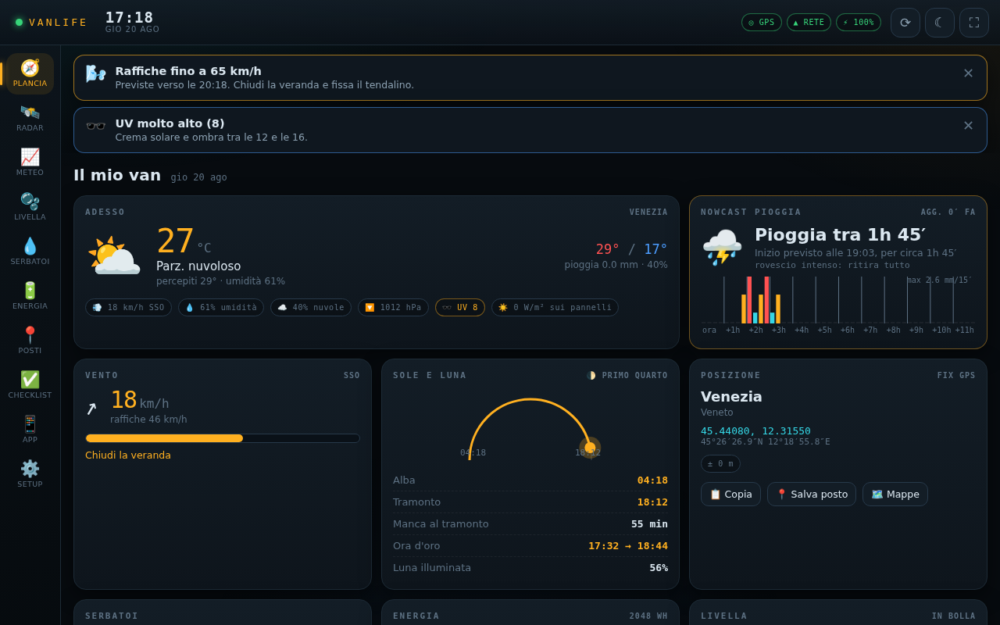
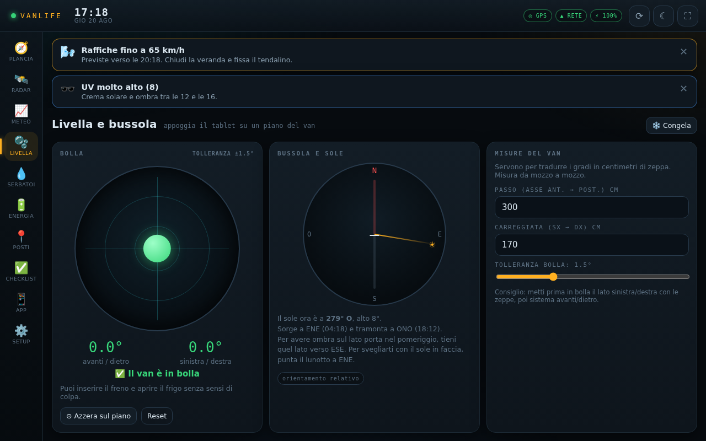

# VanLife · computer di bordo

Una plancia da tablet Android per la vita in van: radar della pioggia, avvisi meteo
geolocalizzati, livella per mettere il mezzo in bolla, serbatoi, energia, posti salvati,
checklist di partenza e le scorciatoie alle app di bordo (Bluetti compresa).

È una **web app installabile** (PWA): niente Play Store, niente account, niente server.
Si apre in Chrome, si installa sulla schermata Home e funziona a schermo intero come
un'app normale. I dati restano sul tablet.





---

## Provarla subito

### 1. Pubblicala su GitHub Pages (consigliato)

Serve `https`, altrimenti Android non dà GPS, sensori e installazione.

1. Su GitHub: **Settings → Pages → Source: GitHub Actions**.
2. Scheda **Actions → "Pubblica su GitHub Pages" → Run workflow**, scegliendo questo branch.
3. Apri l'indirizzo che compare (`https://<utente>.github.io/VanLife/`) con Chrome sul tablet.
4. Menu di Chrome (⋮) → **Installa app**. Ora hai l'icona sulla Home.

### 2. In locale, per provarla al volo

```bash
python3 -m http.server 8099
# poi apri http://localhost:8099
```

Da un altro dispositivo l'indirizzo `http://192.168.x.x:8099` funziona, ma senza `https`
il browser blocca GPS e sensori: per l'uso vero conviene Pages.

---

## Cosa c'è dentro

| Sezione | A cosa serve |
|---|---|
| **Plancia** | Colpo d'occhio: meteo ora, pioggia in arrivo, vento, sole e luna, posizione, serbatoi, batteria, livella. |
| **Radar** | Radar delle precipitazioni RainViewer: due ore di passato e mezz'ora di previsione, animate sulla mappa, centrate su di te. Sfondi strade / notte / satellite / topografico. |
| **Meteo** | Prossime 24 ore (grafico temperatura + pioggia + probabilità), vento ora per ora con la tua soglia, sette giorni, consigli scritti per chi dorme in un van. |
| **Livella** | Bolla a schermo con i gradi tradotti in **centimetri di zeppa sotto le ruote**, più bussola e posizione del sole (per scegliere da che parte mettere il muso). |
| **Serbatoi** | Acqua chiara, grigie, cassetta WC e gas. Autonomia in giorni, scorciatoie tipo "doccia −25 L", storico dei movimenti. |
| **Energia** | Stato di carica della power station, carichi accesi, autonomia residua, **resa solare prevista** dalla radiazione del giorno e bilancio energetico. |
| **Posti** | "Dove ho parcheggiato", punti acqua, camper service, panorami. Distanza, direzione, navigazione con un tocco, condivisione. |
| **Checklist** | Prima di partire / arrivo in piazzola / camper service. Modificabili, azzerabili. |
| **App** | Griglia di scorciatoie alle app native: Bluetti, Park4Night, mappe, musica… più azioni rapide (condividi posizione, 112, camper service vicini). |
| **Setup** | Soglie degli avvisi, dati del van, notifiche, backup. |

### Gli avvisi

Vengono ricalcolati a ogni aggiornamento meteo e appaiono in cima allo schermo
(con notifica di sistema, se l'hai concessa):

- pioggia in arrivo entro il tuo preavviso, con quanto durerà
- raffiche oltre la soglia → "chiudi la veranda"
- temporale o neve nelle prossime ore
- gelo notturno → scarica le grigie
- caldo e UV alto
- tramonto vicino → è ora di cercare un posto per la notte
- acqua agli sgoccioli, grigie o cassetta piene, batteria bassa

Soglie e preavvisi si regolano in **Setup**.

### Modalità notte e torcia

Il pulsante ☾ in alto accende un velo rosso: leggi la plancia senza accecarti né
svegliare chi dorme. **Tienilo premuto** e il tablet diventa una torcia bianca.

---

## Un paio di cose da sapere

- **La scorciatoia Bluetti** usa il nome pacchetto `net.poweroak.bluetticloud`. Se sul tuo
  tablet l'app ha un pacchetto diverso, la piastrella apre il Play Store invece dell'app:
  tienila premuta e correggi il pacchetto. Lo trovi nell'indirizzo della scheda Play Store,
  dopo `id=`. Vale per qualsiasi app che vuoi agganciare.
- **Le notifiche arrivano mentre il tablet è acceso.** Una PWA non ha un servizio in
  background come un'app nativa: se il tablet è spento o l'app è chiusa da ore, gli avvisi
  li vedi alla riapertura. Con il tablet fissato e alimentato (opzione *Tieni acceso lo
  schermo* in Setup) il computer di bordo resta vivo e avvisa in tempo reale.
- **Non è un bollettino ufficiale.** Gli avvisi nascono da modelli meteo: utilissimi per
  decidere se ritirare la veranda, non per un'allerta di protezione civile. Per quella,
  i canali istituzionali.
- **Offline**: guscio dell'app, ultimo meteo scaricato e mappe già viste restano
  disponibili. Il radar animato ha bisogno di rete.
- **Il nowcast a 15 minuti** (la stima "pioggia tra 40 minuti") copre Europa centrale e
  Nord America; altrove la plancia ripiega sulle previsioni orarie.
- **Backup**: i dati vivono solo nel browser del tablet. In Setup c'è Esporta/Importa:
  usalo prima di svuotare la cache o di cambiare tablet.

---

## Com'è fatto

Nessun framework, nessun passaggio di build: sono file statici che il browser esegue così
come sono.

```
index.html            guscio, avvio
css/app.css           tema "cockpit" (unico foglio di stile)
js/app.js             navigazione, orologio, stato sistemi, ciclo dati
js/util.js            DOM, formattazione, geometria, storage
js/store.js           stato persistito (impostazioni, serbatoi, posti, checklist, app)
js/geo.js             GPS continuo + nome del luogo
js/weather.js         Open-Meteo + metadati RainViewer + letture derivate
js/alerts.js          motore degli avvisi
js/tilt.js            accelerometro (livella) e bussola
js/launcher.js        apertura delle app native via intent://
js/ui.js              barre, indicatori, grafici su canvas
js/views/*.js         una sezione per file
sw.js                 service worker: offline e cache dei tasselli
tools/make_icons.py   rigenera le icone PNG
```

Dati e librerie: [Open-Meteo](https://open-meteo.com) (meteo, CC BY 4.0),
[RainViewer](https://www.rainviewer.com) (radar), [OpenStreetMap](https://www.openstreetmap.org)
e CARTO / OpenTopoMap / Esri (sfondi mappa), [Leaflet](https://leafletjs.com) e
[SunCalc](https://github.com/mourner/suncalc), inclusi nel repository in `vendor/`
così l'app parte anche senza rete.

Buon viaggio. 🚐
